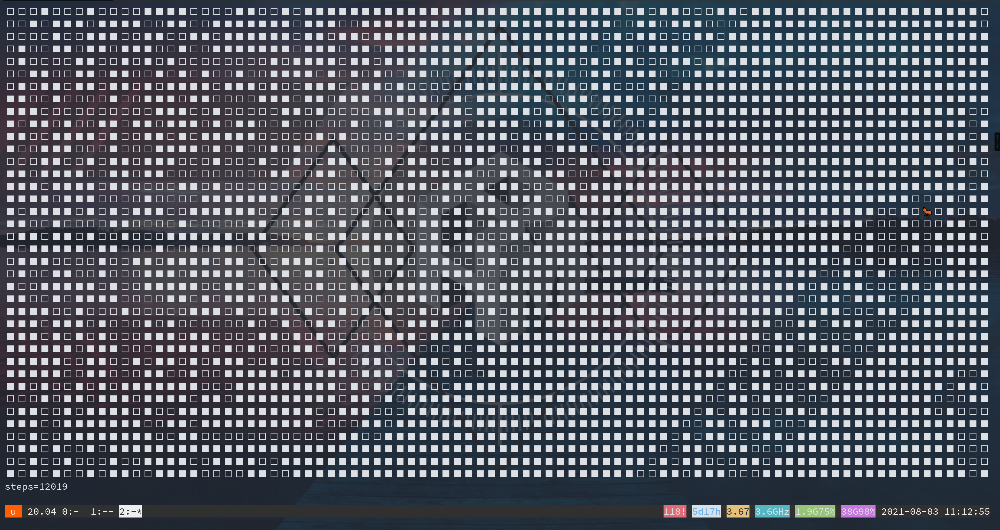

# Langton's Ant

<p align="center">
    
    <a href="./LICENSE">
        
    </a>
</p>

See [Langton's Ant](https://en.wikipedia.org/wiki/Langton%27s_ant) on wikipedia for more details.

## Usage

```shell
$ git clone https://github.com/Pagliacii/langton-ant
$ cd langton-ant
# Usage: langton.py [rules_file | ./rules/origin.json] [fps | 2]
$ python langton.py
```

## Rules Template

```python
{
    "default": "white",      # Default color, uses to generate the empty plane
    "white": {
        "symbol": "\u2b1b",  # A symbol to represent this cell
        "turn": "right",     # Turn left or right
        "flip": "black"      # Flips to this new color
    },
    "black": {
        "symbol": "\u2b1c",
        "turn": "left",
        "flip": "white"
    }
}
```

## Screencast


## Highway Pattern


