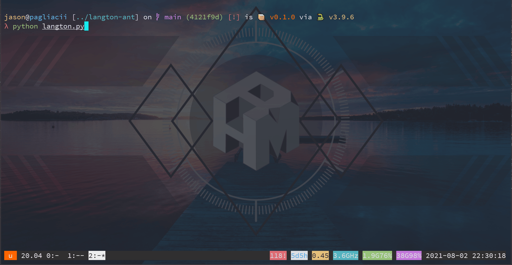

# Langton's Ant

<p align="center">
    
    <a href="./LICENSE">
        
    </a>
</p>

See [Langton's Ant](https://en.wikipedia.org/wiki/Langton%27s_ant) on wikipedia for more details.

## Usage

```shell
$ git clone https://github.com/Pagliacii/langton-ant
$ cd langton-ant
$ python langton.py
```

## Screencast


